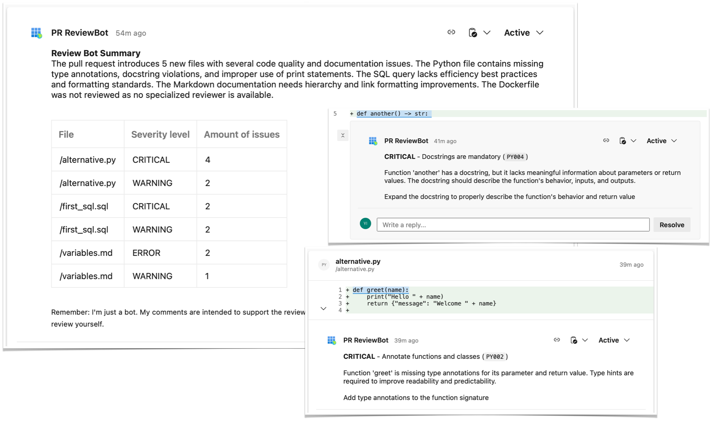
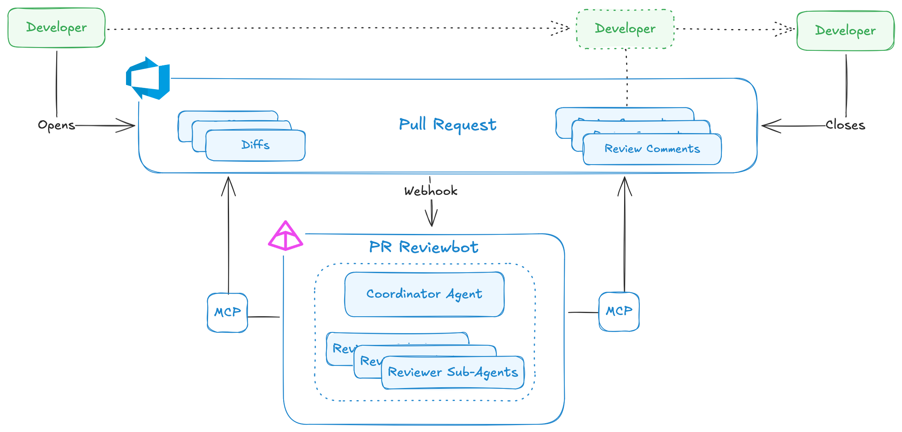
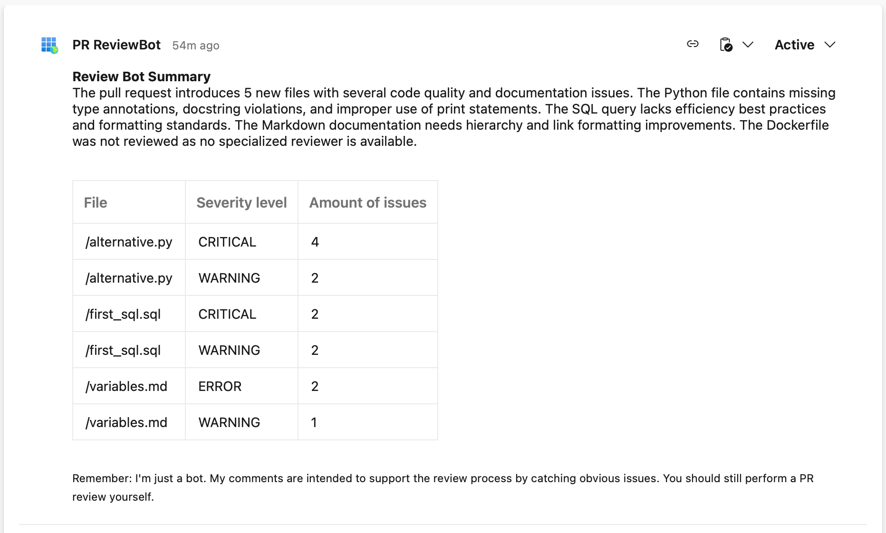
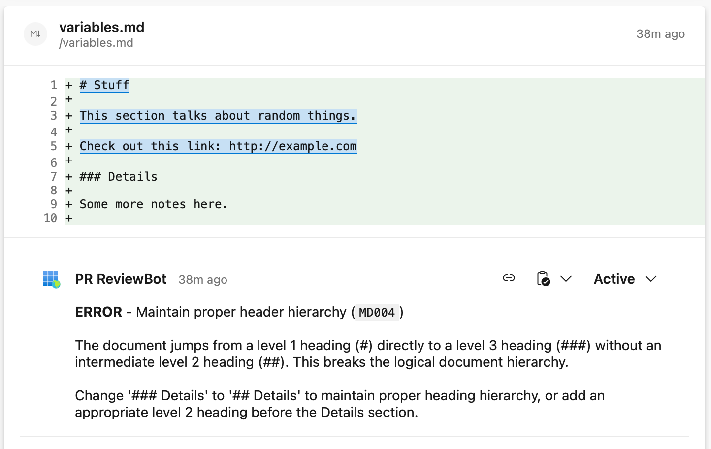
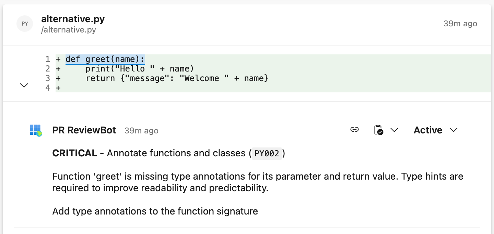
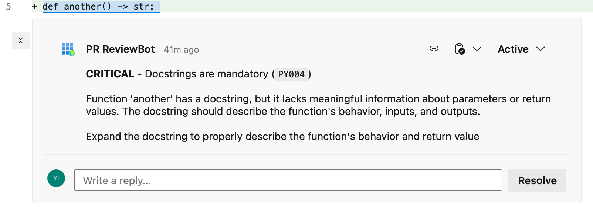
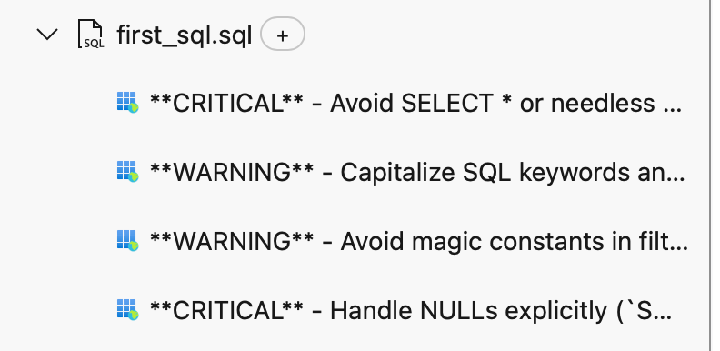

# Azure DevOps Pull Request Review Bot

> I am aware how silly it is to have code for an Azure DevOPS PR review system in a Github repository. Just
easier to keep the repo public that way.

## Introduction
Github has a [copilot review](https://docs.github.com/en/copilot/how-tos/use-copilot-agents/request-a-code-review/use-code-review)
feature for pull requests. As is often the case, Azure DevOps is a little behind the times and doesn't have a similar
feature. Since a shift to Github may not always be feasible or desirable, I set out to build something similar for Azure DevOps.

This repo contains a pull request review bot for Azure DevOps implemented as multi-agent system. It reviews
pull requests autonomously based on a set of rules and then provides guidance on where and why code should be modified.
It forces developers to actively close the comments it leaves (thus proving the review was not ignored), but **humans
always have the final say** and can choose to ignore the system's recommendations. Thanks to [Azure DevOps
webhooks](https://learn.microsoft.com/en-us/azure/devops/service-hooks/services/webhooks?view=azure-devops), reviews
are triggered in near-realtime.

This README guides you through most of what you need to know, but there are some additional README files in various
folders in the repository. There's also a [separate docs folder](docs) with extensive documentation.

While this is an AI agent system I want to be explicit about the role of AI in this repository itself:
- I took AI help here and there for trivial tasks (like generating the Pydantic models that mirror the input and
  output models of the Azure DevOps API), but there has been no vibe coding.
- An LLM did not touch any of my markdown files. I don't want to contribute to yet more meaningless AI slop. Nuance
  and authenticity are important. Besides, if I don't bother writing it, why would you bother reading it?

---
 

## What this is (and what this isn't)
The main goal was to create a _real, working system_ with a good set of non-functional essentials
in place and not a hello-world PoC. Similarly I had no interest in something too heavily AI-generated that looks
convincing but goes off the rails when it comes to details.

**This is:** A solution that works as-is and has all the core features you'd expect from a real world solution. It
is a good starting point for extension and larger scale usage.
  

**Included out-of-box:**
- A coordinator agent, autonomous sub-agents and a fallback agent in case of errors;
  - Easily customizable rulesets including custom instructions and severity grades per rule;
  - A modular setup that is easily extensible with additional sub-agents;
- A FastAPI wrapper to react to Azure DevOps webhook events;
  - An async webhook event subscription mechanism;
- An HTTP MCP server;
- Strict typing & Pydantic models everywhere;
- API and tool call rate limiting;
- CI/CD automation;
- Unit tests and a combination of deterministic and LLMJudge evals;
- Full-featured observability;
- Thorough documentation.

**This is not:** A fully completed enterprise grade solution. It's perfectly usable, but you will find some
pragmatic choices have been made in some places or that an initial implementation was
done that could (should?) be extended / changed later. The core is solid, but at time of writing (November 2025) this
repo was built only in evening and weekend hours. And very simply put: I wasn't willing to spend any meaningful
amount of money. _Some ideas for future extension are listed at the bottom of this page._

---
 

## How to use
This bot should be deployed as a docker container wherever you see fit, so long as it's reachable from Azure DevOps.
All docs assume Azure itself.

You can run the solution locally as well, though you'd need to simulate the webhook as Azure DevOps obviously can
not reach localhost. You will retain all features incl. observability when running locally.
> [Click me for the full documentation page!](docs/usage-guide.md)

---
 

## Solution Architecture
> [Click me for the full documentation page!](docs/architecture.md)

---
 

## Observability
> [Click me for the full documentation page!](docs/observability.md)

---
 

## Futureproofing & extending
At time of writing (November 2025) it's entirely possible I will park this one to work on other things, but there
are plenty of changes or improvements I'd like to make.

I'm noting them down here to give you a sense of what I'm thinking about:
- _Decoupling prompts from code_ via some prompt management solution, so they can be iterated on independently of an
  app redeployment;
- _Increasing the robustness of the fallback setup_ by first trying other model providers before defaulting to the error handler agent;
- _Remove the dependency on the public internet for agent LLMs_ via Azure AI Foundry or Databricks;
- _Extending the evals_ and using them to select the most fit-for-purpose LLM per sub-agent;
- _Deploying the MCP server as stand-alone container_;
- Not only supporting per-language code review rules but also _framework-specific rules_;
- Enabling _context-aware reviews across multiple files_ instead of file-by-file;
- API endpoints and agents set up to _handle other Azure DevOps PR webhook events_ like new updates to the same PR
  and comment responses by developers
- _Private networking, better security and API management_, the current rate limits and JWT tokens are quite basic. At
  the very least we should be able to revoke a token when abuse is detected.

---
 

## Additional Screenshots
All screenshots used in the various documentation pages can be found [here](docs/img).

The review summary the agent posts at the end of every review, which always includes a table to clarify which files
need which degree of attention:

Some examples of comments you might see at specific lines in reviewed files:

A view of a file's review comments in the PR file diffs page:
