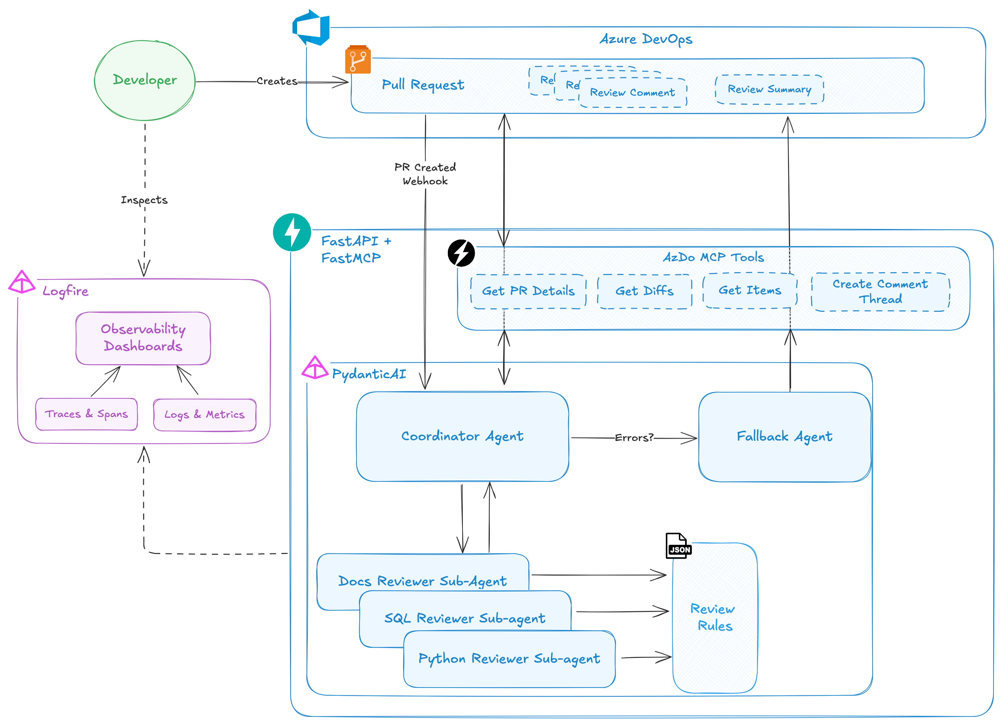

## Solution Architecture

### Agents Behavior

The **coordinator agent** is the main entry point for the solution and is called by the API when a webhook event is
received. It uses MCP tools (see below) to get info about the pull request from Azure DevOps. Depending on what's in
the PR, it then dispatches file contents from the PR to the right **sub-agent** for a code review using the rules
available in the repository. The sub-agents communicate their review back to the coordinator agent, which posts
the reviews and a summary to the PR in Azure DevOps. If the code review fails for whatever reason, the **fallback agent**
is called to post a comment to the pull request about what went wrong.

### Review Rules

Each sub-agent has its own set of review rules which are fully customizable. Rules can be assigned a level of severity
(_"how bad is it if this rule gets violated?"_) and there's a few levers to play with to influence how the agent
treats each rule. Rule specification is defined in the [rules' README](../app/rules/README.md).

### Azure DevOps MCP Server

While an [official Azure DevOps MCP Server](https://github.com/microsoft/azure-devops-mcp) exists I chose to write my own. I wanted full control of the MCP server's
I/O and how the underlying REST API is called.

The MCP server uses [FastMCP](https://gofastmcp.com/getting-started/welcome). It's a streamable HTTP implementation.  While it should obviously be a stand-alone
server for production use, it's currently [mounted onto the API itself](https://gofastmcp.com/integrations/fastapi#mounting-an-mcp-server) as a set of routes so I didn't have to
spend on hosting a second container.

### Observability

Without a good observability solution GenAI apps like these are black boxes. To an extent this applies for all apps,
but it is particularly problematic here. Review the [observability docs](observability.md).

---
 

## Azure Architecture

The Azure cloud architecture for this solution really is very simple and is visualized above.

In enterprise settings we'd expect to invest a fair amount of effort into infrastructure as code, (private)
networking, least privilege on the key vault, etc. This is one of those areas where I made pragmatic choices and
invested a bit less time and effort.

Nevertheless a number of must-haves like key vault integration or container image versioning are covered.
