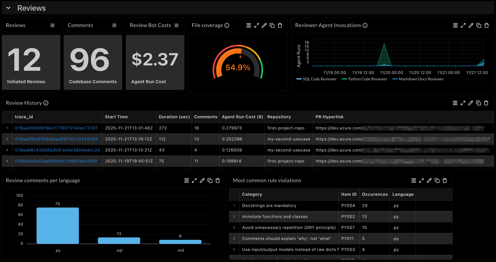
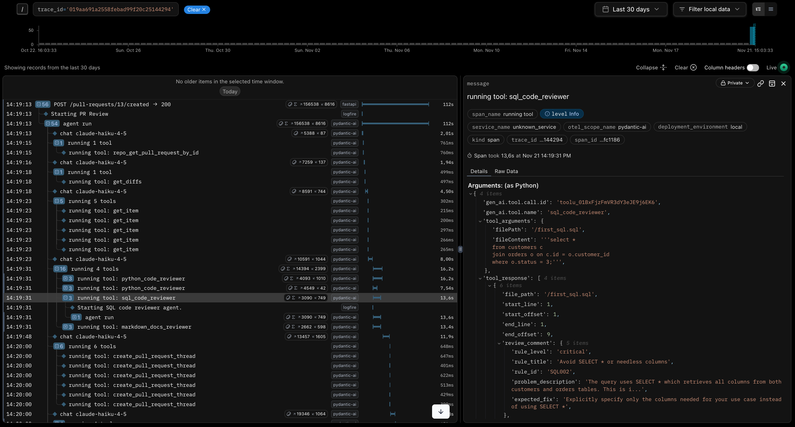
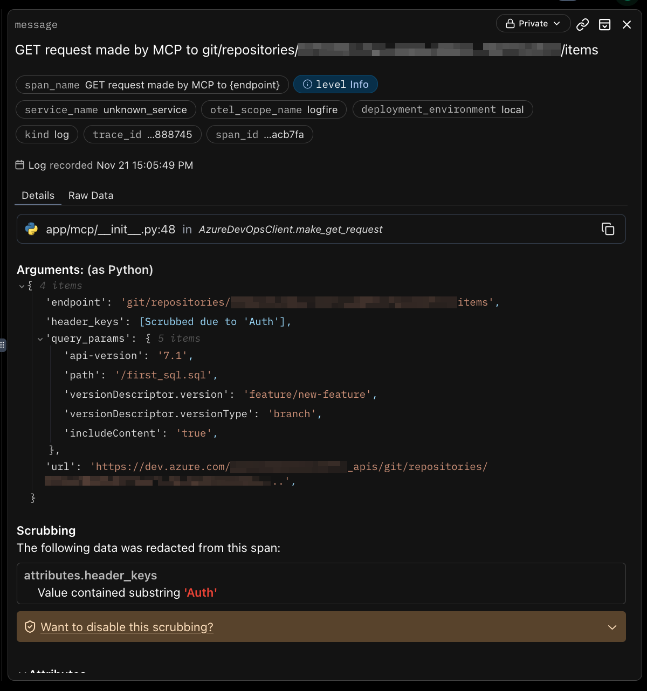
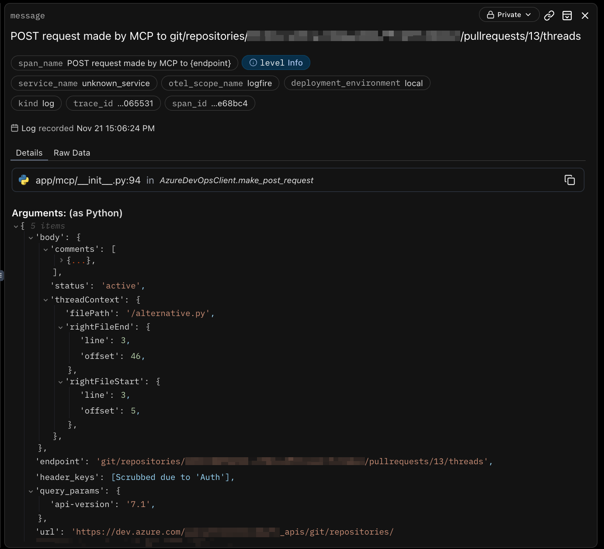

## Observability
PR review agents act with autonomy. The coordinator agent decides on its own what tools need to be called, and the
sub-agents autonomously decide how each rule is treated for each file. We programmatically steer the agents in the right direction,
but that does not change the fact that autonomy means risk. If we're going to build improvements to this
solution over time we're going to need to know exactly what is going on under the hood during each review run.

Observability is built into every aspect of the solution and uses [Logfire](https://pydantic.dev/logfire).
It's set up to automatically separate logs and metrics by environment, ensuring there is an equal quality of observability in
local development as well as in the live app.

Every run of the system is its own entity in the observability system, making it easy to investigate its behavior
end-to-end. Dashboards on LLM token consumption are available by default in Logfire, and I've added a
consolidated dashboard showing the behavior of the reviewer system across runs, languages and repositories. Find
some screenshots below.

---
 

### Consolidated Dashboard View
This one's intended as starting point for observability focusing on functional behavior. It's a good starting point to use to
identify potential areas for solution improvement (like file coverage) or where to provide guidance in the
organization (like most violated rules).

From here you can drill down into any specific traced run of the solution.

The consolidated dashboard view is custom-built and it's available in this repository to be imported into Logfire.
Check out the [observability folder](/app/observability).

---
 

### Traces
These of course help deepdive into each individual run of the solution. The traces show every app invocation, agent run,
tool call, and FastAPI interaction in detail in terms of inputs, outputs, timelines and metadata.

Also included is a specific additional span with the precise details of MCP-based Azure DevOps interactions.

